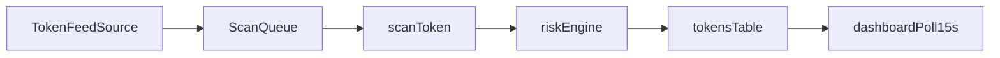

# SolGuard Analysis and Hackathon Strategy

## Current System Snapshot

- Token intake is currently manual via `POST /api/scan` and UI search in `[/Users/gava/solguard/src/app/page.tsx]( /Users/gava/solguard/src/app/page.tsx )`.
- There is a pump.fun live scanner in `[/Users/gava/solguard/src/lib/scanner.ts]( /Users/gava/solguard/src/lib/scanner.ts )` but it hard-depends on `HELIUS_API_KEY` and is not currently invoked anywhere in `src/`.
- Risk scoring is in `[/Users/gava/solguard/src/lib/risk-engine.ts]( /Users/gava/solguard/src/lib/risk-engine.ts )` with weighted factors, pump.fun weight overrides, and kill switches already in place.
- Dashboard already supports “live feel” via polling `/api/tokens` every 15s in `[/Users/gava/solguard/src/app/page.tsx]( /Users/gava/solguard/src/app/page.tsx )`.

## Recommended Direction (No Build Yet)

1. Rank auto-feed sources by implementation speed and reliability for Feb 12 deadline.
2. Add pragmatic scoring signals that fit current DB and API shape with minimal schema churn.
3. Prioritize 1-2 demo “wow” moments that reuse existing pages/components.

## Candidate Ingestion Architecture

## Key Files To Leverage

- `[/Users/gava/solguard/src/lib/scanner.ts]( /Users/gava/solguard/src/lib/scanner.ts )` for queueing/scanning logic and scanner status state.
- `[/Users/gava/solguard/src/lib/risk-engine.ts]( /Users/gava/solguard/src/lib/risk-engine.ts )` for extending scoring and kill-switch logic.
- `[/Users/gava/solguard/src/lib/db.ts]( /Users/gava/solguard/src/lib/db.ts )` for storing any additional telemetry used by score/demo surfaces.
- `[/Users/gava/solguard/src/app/page.tsx]( /Users/gava/solguard/src/app/page.tsx )` and `[/Users/gava/solguard/src/components/ScannerStatus.tsx]( /Users/gava/solguard/src/components/ScannerStatus.tsx )` for visible judge-facing real-time UX.

